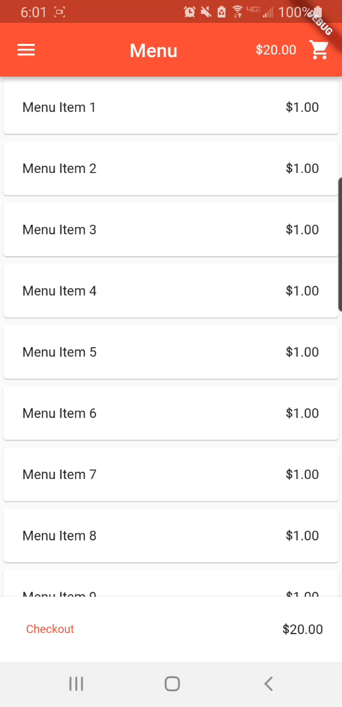

# NAPOS-Customer
A rapidly prototyped interface intended for use in the Napos system. It was not further developed past a rapid prototype.

## Contributors
Jacob Myers

## Project
Napos Customer is a mobile interface for ordering food. Since it is made in Flutter, it can be built as a mobile app or as a web app. Realistically, it would likely be hosted as a web app for customers to interface with. It would access the menu from the restaurant's Napos server, and process payments made by the customer, then send these on to the kitchen to be made and delivered. 

This functionality was not actually implemented, it is purely a visual, navigable interface.

